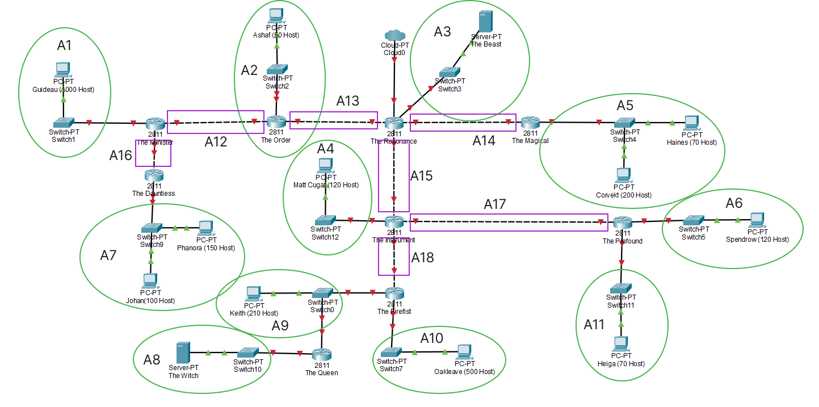
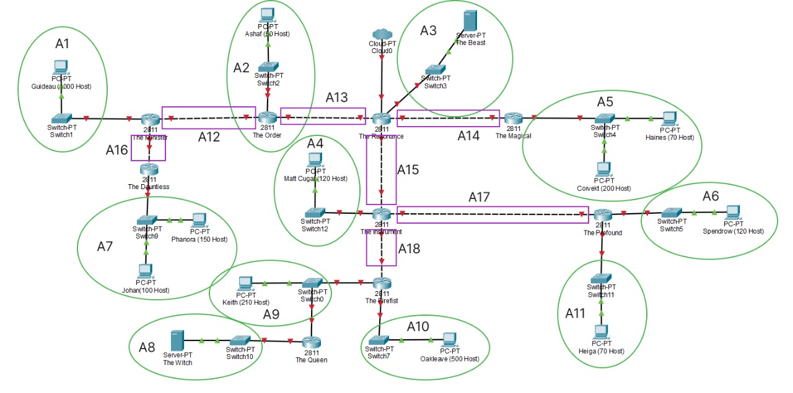
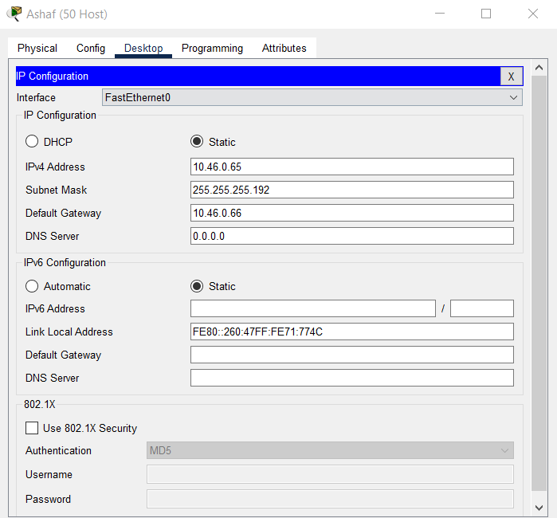
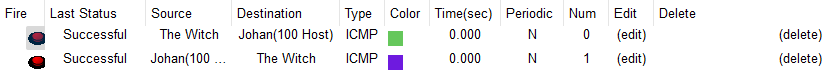
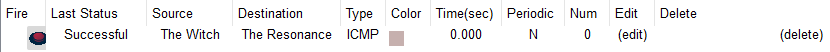
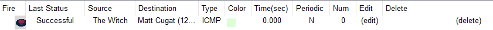
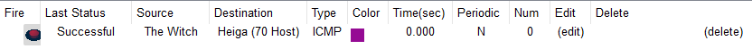
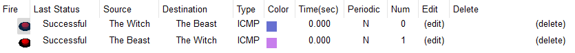
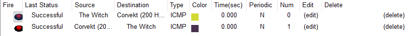

# Jarkom-Modul-4-ITB03-2022
---
Kelompok ITB03:
1. Haffif Rasya Fauzi - 5027201002 (Kontribusi 50%)
2. M. Hilmi Azis - 5027201049 (Kontribusi 0%)
3. Gennaro Fajar Mende - 5027201061 (Kontribusi 50%)
---

## Soal
---
Berikut ini topologi yang perlu dibuat:

1. Soal shift dikerjakan pada Cisco Packet Tracer dan GNS3 menggunakan metode perhitungan CLASSLESS yang berbeda.
2. Keterangan: Bila di CPT menggunakan VLSM, maka di GNS3 menggunakan CIDR atau Sebaliknya
3. Jika tidak ada pemberitahuan revisi soal dari asisten, berarti semua soal BERSIFAT BENAR dan DAPAT DIKERJAKAN.
4. Untuk di GNS3 CLOUD merupakan NAT1 jangan sampai salah agar bisa terkoneksi internet.
5. Pembagian IP menggunakan Prefix IP yang telah ditentukan pada modul pengenalan
6. Pembagian IP dan routing harus SE-EFISIEN MUNGKIN.

## Catatan
---
1. VLSM dikerjakan di Cisco Packet Tracer
2. CIDR dikerjakan di GNS3

## Jawaban
---
### VLSM
---
Hal pertama yang kami lakukan adalah dengan menentukan subnet yang ada pada topologi. Dikarenakan metode yang dipakai adalah VLSM. Kami melingkari tiap host yang terhubung pada interface router dan menghitung IP yang dibutuhkan. Berikut alah gambaran pembagian subnetnya

#### Tabel:  

|Address|Prefix|Subnet Mask|
|------|------|------|
|1|32|255.255.255.255|
|2	|31	|255.255.255.254|
|4	|30	|255.255.255.252|
|8	|29	|255.255.255.248|
|16	|28	|255.255.255.240|
|32	|27	|255.255.255.224|
|64	|26	|255.255.255.192|
|128	|25	|255.255.255.128|
|256	|24	|255.255.255.0|
|512	|23	|255.255.254.0|
|1024	|22	|255.255.252.0|
|2048	|21	|255.255.248.0|
|4096	|20	|255.255.240.0|
|8192	|19	|255.255.224.0|
|16384	|18	|255.255.192.0|
|32768	|17	|255.255.128.0|
|65536	|16	|255.255.0.0|
|131072	|15	|255.254.0.0|
|262144	|14	|255.252.0.0|
|524288	|13	|255.248.0.0|
|1048576	|12	|255.240.0.0|
|2097152	|11	|255.224.0.0|
|4194304	|10	|255.192.0.0|
|8388608	|9	|255.128.0.0|
|16777216	|8	|255.0.0.0|

#### Tabel Perhitungan IP  

|Jenis Jaringan	|Nama Subnet	|Jumlah Host	|Dialokasikan	|Mask|
|------         |------     |------         |------         |------  |
|Subnet	        |A1	        |1001	        |1024	        |/22|
|Subnet	        |A2	        |51	            |62	            |/26|
|Switch - Server	|A3	    |2	            |4	            |/30|
|Subnet	        |A4	        |121	        |126	        |/25|
|Subnet	        |A5	        |271	        |510	        |/23|
|Subnet	        |A6	        |121	        |126	        |/25|
|Subnet	        |A7	        |251	        |254	        |/24|
|Switch - Server	|A8	    |2	            |4	            |/30|
|Subnet	        |A9	        |212	        |254	        |/24|
|Subnet	        |A10	    |501	        |510	        |/23|
|Subnet	        |A11	    |71	            |126	        |/25|
|Router - Router	|A12	|2	            |4	            |/30|
|Router - Router	|A13	|2	            |4	            |/30|
|Router - Router	|A14	|2	            |4	            |/30|
|Router - Router	|A15	|2	            |4	            |/30|
|Router - Router	|A16	|2	            |4	            |/30|
|Router - Router	|A17	|2	            |4	            |/30|
|Router - Router	|A18	|2	            |4	            |/30|

#### Tabel Perhitungan IP
|Nama Subnet	|Size Diperlukan	|Dialokasikan	|Netmask	|Subnet Mask	|Network ID	|Assignable IP Range	|Broadcast Address|
|---------------|-------------------|---------------|-----------|---------------|-----------|-----------------------|-----------------|
|A3	    |2	    |2	    |/30	|255.255.255.252	|10.46.0.0	|10.46.0.1 - 10.46.0.2	    |10.46.0.3|
|A8	    |2	    |2	    |/30	|255.255.255.252	|10.46.0.4	|10.46.0.5 - 10.46.0.6	    |10.46.0.7|
|A12    |2	    |2	    |/30	|255.255.255.252	|10.46.0.8	|10.46.0.9 - 10.46.0.10	    |10.46.0.11|
|A13	|2	    |2	    |/30	|255.255.255.252	|10.46.0.12	|10.46.0.13 - 10.46.0.14	|10.46.0.15|
|A14	|2	    |2	    |/30	|255.255.255.252	|10.46.0.16	|10.46.0.17 - 10.46.018	    |10.46.0.19|
|A15	|2	    |2	    |/30	|255.255.255.252	|10.46.0.20	|10.46.0.21 - 10.46.0.22	|10.46.0.23|
|A16	|2	    |2	    |/30	|255.255.255.252	|10.46.0.24	|10.46.0.25 - 10.46.0.26	|10.46.0.27|
|A17	|2	    |2	    |/30	|255.255.255.252	|10.46.0.28	|10.46.0.29 - 10.46.0.30	|10.46.0.31|
|A18	|2	    |2	    |/30	|255.255.255.252	|10.46.0.32	|10.46.0.33 - 10.46.0.34	|10.46.0.35|
|A2	    |51	    |62	    |/26	|255.255.255.192	|10.46.0.64	|10.46.0.65 - 10.46.0.126	|10.46.0.127|
|A4	    |121	|126	|/25	|255.255.255.128	|10.46.0.128|10.46.0.129 - 10.46.0.254	|10.46.0.255|
|A6	    |121	|126	|/25	|255.255.255.128	|10.46.1.0	|10.46.1.1 - 10.46.1.126	|10.46.1.127|
|A11	|71	    |126	|/25	|255.255.255.128	|10.46.1.128|10.46.1.129 - 10.46.1.254	|10.46.1.255|
|A7	    |251	|254	|/24	|255.255.255.0	    |10.46.2.0	|10.46.2.1 - 10.46.2.254	|10.46.2.255|
|A9	    |212	|254	|/24	|255.255.255.0	    |10.46.3.0	|10.46.3.1 - 10.46.3.245	|10.46.3.255|
|A10	|501	|510	|/23	|255.255.254.0	    |10.46.4.0	|10.46.4.1 - 10.46.5.254	|10.46.5.255|
|A5	    |271	|510	|/23	|255.255.254.0	    |10.46.6.0	|10.46.6.1 - 10.46.7.254	|10.46.7.255|
|A1	    |1001	|1022	|/22	|255.255.252.0	    |10.46.8.0	|10.46.8.1 - 10.46.11.254	|10.46.11.255|
|Total	|2618	|	    |/20				|

#### Konfigurasi pada Cisco Packet Tracer
    
  

Melakukan Assign seluruh Host dan Interface Router sesuai dengan tabel perhitungan yang telah dibuat Untuk melakukan Assign contohnya adalah sebagai berikut:  
1. Pada bagian Host/ Server buka Desktop, Ip Configuration lalu isikan: IP4 address: [IP Host] Subnet Mask: [Subnet pada bagian tersebut] Gateway: [IP Router Interface yang terhubung ke host]. Contoh konfigurasi pada host PC-PC Ashaf yang terhubung dengan Router The Order. 
  
2. Pada bagian Router melakukan Assign terhadap IP Address dan subnet mask interface router tersebut. Contoh konfigurasi pada Router The Order.  

Testing Ping:
- Dari PC-PT Guideau ke PC-PC Johan.
  
- Dari PC-PT Ashaf ke PC-PT Spendrow.

- Dari Server-PT The Witch ke PC-PT Johann dan juga sebaliknya.

- Dari Server-PT The Witch ke Router The Resonance.

- Dari Server-PT The Witch ke PC-PT MattCugat.

- Dari Server-PT The Witch ke PC-PT Heiga.

- Dari Server-PT The Witch ke Server-PT Beast dan sebaliknya.

- Dari Server-PT The Witch ke PC-PT Corvekt dan sebaliknya.

### CIDR
---
Berikut langkah-langkah subnetting dan router menggunakan metode CIDR.
1. Langkah pertama

2. Langkah kedua

3. Langkah ketiga

4. Langkah keempat

5. Langkah kelima

6. Langkah keenam

7. Langkah ketujuh

8. Langkah kedelapan

#### Tabel kesimpulan kombinasi CIDR
|Langkah|Hasil Kombinasi|Sumber Kombinasi|Prefix Sebelum|Prefix Kombinasi|
|---|---|---|---|---|
|1|B1|A7 + A16|/24 + /30| /23|
|1|B2|A8 + A9 |/30 + /24| /23|
|1|B3|A5 + A14|/23 + /30| /22|
|1|B4|A6 + A11|/25 + /25| /24|
|2|C1|A1 + B1 |/22 + /23| /21|
|2|C2|A10 + B2|/23 + /23| /22|
|2|C3|A3 + B3 |/30 + /22| /21|
|2|C4|A17 + B4|/30 + /24| /23|
|3|D1|A12 + C1|/30 + /21| /20|
|3|D2|A18 + C2|/30 + /22| /21|
|4|E1|A2 + D1 |/26 + /20| /19|
|4|E2|A4 + D2 |/25 + /21| /20|
|5|F1|A13 + E1|/30 + /19| /18|
|5|F2|C4 + E2 |/23 + /20| /19|
|6|G1|A15 + F2|/30 + /19| /18|
|7|H1|c3 + G1 |/21 + /18| /17|
|8|I1|F1 + H1 |/18 + /17| /16|

## Kendala
1. Kami masih belum terlalu memahami konsep CIDR dan masih kesulitan dalam melakukan konfigurasi di GNS3.
2. Pada Cisco terkadang terdapat error terlebih dahulu dalam melakukan ping.
